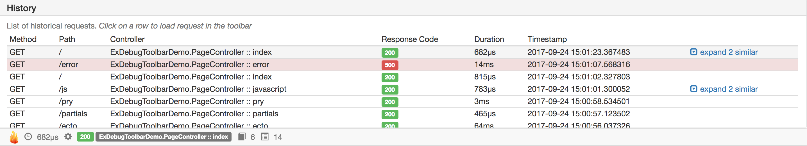
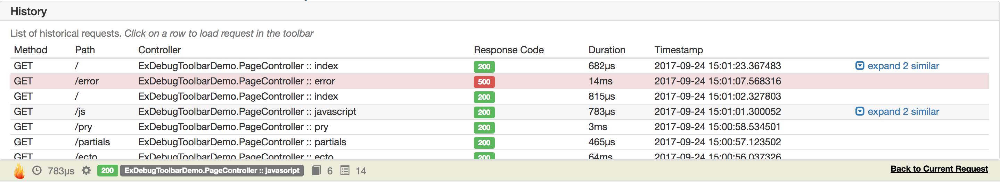

[](https://travis-ci.org/kagux/ex_debug_toolbar)
[](https://hex.pm/packages/ex_debug_toolbar)

A toolbar for Phoenix projects to display all sorts of information
about current and previous requests: logs, timelines, database queries etc.

Project is in its early stages and under active development.
Contributions to code, feedback and suggestions will be much appreciated!


# Recent changes
  ### Version 0.4.0
   * _(new)_ requests history panel
   * _(new)_ support Slim templates (`phoenix_slim` package)
   * _(new)_ `debug` config key to enable to verbose logs
   * _(new)_ `ignore_paths` config key to skip tracking certain requests by paths
   * _(improved)_ breakpoints no longer use distribution code


# Features
Toolbar is built with development environment in mind. It's up to you to enable or disable it in configuration.
Calls to toolbar functions such as `Toolbar.pry` are no-op when it is disabled.

After enabling the toolbar, it automatically injects itself at the bottom of html pages.
Some panels on the toolbar are optional and only appear when relevant data is available (ecto queries, for example).


Let's take a look at available panels:

### Timings
It shows overall time spent rendering current controller as reported by Phoenix instrumentation.
In addition, it provides aggregated stats for each template.


### History
A list of previous request.

Clicking on historical request loads it into toolbar so you can inspect it closer.


### Connection details
Surfaces information from `conn` struct of current request.


### Logs 
Log entries relevant to current request only


### Ecto queries
A list of executed ecto queries including parallel preloads when possible.


### Breakpoints
Think of having multiply `IEx.pry` breakpoints available on demand right from the toolbar.
Note, unlike `IEx.pry`, this does not interfere with execution flow of phoenix server.

Usage is similar to `IEx`.
Drop `require ExDebugToolbar; ExDebugToolbar.pry` in a file you'd like to debug
and breakpoint will appear in this panel. Breakpoints are capped at configurable number per 
request (10 by default).


A click on any breakpoint will take you to familiar `iex` session with context as it was at execution time.


# Installation
  1. Add `ex_debug_toolbar` to your list of dependencies in `mix.exs`:

   ```elixir
   def deps do
     [{:ex_debug_toolbar, "~> 0.4.0"}]
   end
   ```

  2. Ensure `:ex_debug_toolbar` is started before your application:

   ```elixir
   def application do
     [applications: [:ex_debug_toolbar, :logger]]
   end
   ```

  2. Add `ExDebugToolbar.Phoenix` to your endpoint in `lib/my_app/endpoint.ex`

  ```elixir
    defmodule MyApp.Endpoint do
      use Phoenix.Endpoint, otp_app: :my_app
      use ExDebugToolbar.Phoenix
      ...
    end
  ```

  3. Enable toolbar in config `config/dev.exs` and setup collectors. Replace `:my_app` and `MyApp` with your application name

     _Note_: Slim templates support requires [phoenix_slime](https://github.com/slime-lang/phoenix_slime) package

  ```elixir
    # ExDebugToolbar config
    config :ex_debug_toolbar,
      enable: true

    config :my_app, MyApp.Endpoint,
      instrumenters: [ExDebugToolbar.Collector.InstrumentationCollector]

    config :my_app, MyApp.Repo,
      loggers: [ExDebugToolbar.Collector.EctoCollector, Ecto.LogEntry]

    config :phoenix, :template_engines,
      eex: ExDebugToolbar.Template.EExEngine,
      exs: ExDebugToolbar.Template.ExsEngine,
      #slim: ExDebugToolbar.Template.SlimEngine,
      #slime: ExDebugToolbar.Template.SlimEngine

  ```

  4. To display parallel Ecto preloads you have to use `master` branch
  ```elixir
    defp deps do
      [
       {:ecto, github: "elixir-ecto/ecto", branch: "master", override: true}
      ]
    end
  ```

# Configuration

To change configuration, update `:ex_debug_toolbar` config key in your `config/dev.exs`. For example: 
```elixir
    config :ex_debug_toolbar,
      enable: true
```

### Available options:

| Option             | Values  | Default                                                                                      | Description                                                                                                         |
|--------------------|---------|----------------------------------------------------------------------------------------------|---------------------------------------------------------------------------------------------------------------------|
| enable             | boolean | false                                                                                        | Enable/disable toolbar. When disabled, toolbar code is not injected in page and toolbar functions are mostly no-op. |
| iex_shell          | string  | "/bin/sh"                                                                                    | Shell executable to be used for breakpoint session                                                                  |
| iex_shell_cmd      | string  | "stty echo; clear; iex -S mix breakpoint.client --breakpoint-file %{breakpoint_file}"        | Shell command to launch breakpoint iex session. `%{breakpoint_file}` is a placeholder for tmp file with data        |
| breakpoints_limit  | integer | 10                                                                                           | Maximum number of breakpoints per request. After reaching this cap, new breakpoints will be ignored                 |
| remove_glob_params | boolean | true                                                                                         | `Plug.Router` adds `glob` params to `conn.params` and `conn.path_params` on `forward`. This option removes them     |
| ignore_paths       | list    | [~r{^/images/}, ~r{^/css/}, ~r{^/js/}, ~r{^/phoenix/live_reload/}]                           | A list of paths that should not be recorded by toolbar. Each item can be either string for exact match or a Regex.  |
| debug              | boolean | false                                                                                        | Toggles debug logs. Requires recompilation for some logs                                                            |
| max_requests       | integer | 30                                                                                           | Number of requests to keep in history                                                                               |


# Troubleshooting

### Poison encode issues

If you see `poison` encode related errors in your logs:
* update to latest `poison` package version
* enable debug mode and open an issue with detailed logs

### Debug mode

When enabled, toolbar prints debug logs.
This information is very helpful for issues with encoding, missing requests, etc.

Turn on debug mode

```elixir
    config :ex_debug_toolbar,
      enable: true,
      debug: true
```

Turn off `Logger` log truncation and put it into `debug` level

```elixir
    config :logger,
      level: :debug,
      truncate: :infinity
```

Recompile toolbar to see channel logs

```
    mix deps.compile ex_debug_toolbar --force
```


# Contributors
Special thanks goes to [Juan Peri](https://github.com/epilgrim)!

# Contribution
  Contributions in the form of bug reports, pull requests, or thoughtful discussions in the GitHub issue tracker are welcome!

# TODO
- [ ] Toolbar panels
  - [ ] Messages output panel (Toolbar.inspect and Toolbar.puts)
  - [ ] System info panel (versions, vm info, etc)
  - [ ] Help/Docs Panel (links to dev resources)
  - [ ] Request time panel
    - [ ] Request history (historical graphs?)
    - [ ] Visualize timeline
  - [ ] Ajax requests panel
  - [ ] Channels info panel
  - [ ] Visualize gettext
- [ ] Toolbar API
  - [ ] Decorator for functions to time them
  - [ ] Add metadata to events and use groupable names (template.render, controller.render etc)
- [ ] Tests
  - [ ] breakpoints
    - [ ] client test
    - [ ] terminal test
- [ ] Simple installer mix task
- [ ] Upgrade to Phoenix 1.3
- [ ] Elm/React instead of jquery?

## Demo App
  Use [demo app](https://github.com/kagux/ex_debug_toolbar_demo) to simplify development process.
